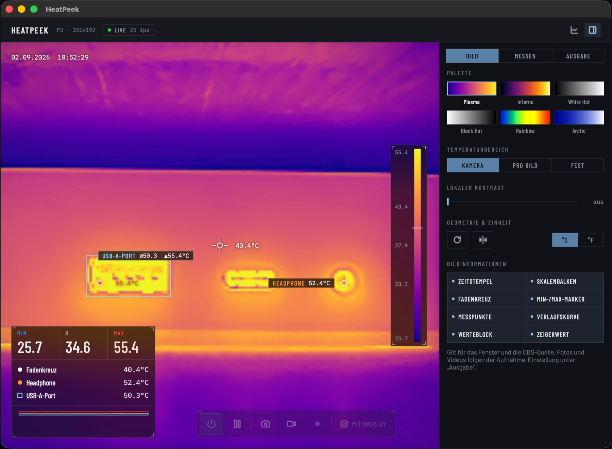
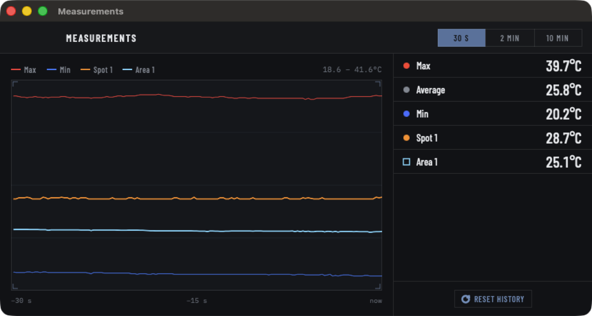

# HeatPeek

A native macOS app for USB thermal cameras of the P series.



| Model | USB VID / PID | Resolution |
|-------|---------------|------------|
| P3 | `0x3474` / `0x45A2` | 256 × 192 |
| P1 | `0x3474` / `0x45C2` | 160 × 120 |

The same hardware is sold under several names — the P3 is the device also
marketed as "InfiRay P2 Pro". What identifies a camera is its VID and PID, not
the print on the case. Model parameters live in `P3Model`; no sensor size is
hard-coded anywhere else, so another model is one entry in `P3Model.all`.

**Only the P3 has been tested against real hardware.** The P1 path is covered
end to end with a synthetic frame (parsing, emissivity, rotation, area
statistics, every scale mode, overlay), but not with a device.

The camera is driven straight from user space through Apple's **IOUSBHost**
framework — no kernel extension, no libusb, no driver to install. The vendor
USB protocol comes from the reverse-engineering project
[jvdillon/p3-ir-camera](https://github.com/jvdillon/p3-ir-camera)
(see `P3_PROTOCOL.md` there).

## Requirements

- macOS 14 or later, Apple silicon or Intel
- A supported camera on USB-C

Building additionally needs Xcode 15+ and
[XcodeGen](https://github.com/yonaskolb/XcodeGen) (`brew install xcodegen`).

## Install

The disk image is published on [heatpeek.com](https://heatpeek.com), not as a
release here. Download it there, drag HeatPeek to Applications and launch it. The released build is signed and notarised, and its ticket is
stapled to both the app and the image, so it opens straight away — even on a
machine that is offline the first time. A build made without those credentials
is signed ad-hoc instead, and macOS then warns about an unidentified developer
on first launch: right-click the app, choose *Open*, and confirm once.

## Build from source

```bash
xcodegen generate
xcodebuild -project HeatPeek.xcodeproj -scheme HeatPeek -configuration Release build
```

To produce the distributable disk image instead:

```bash
./Scripts/build-dmg.sh
```

The result lands in `dist/HeatPeek-<version>.dmg`, built for both
architectures. Signing follows what the machine can do: with a Developer ID
certificate in the keychain the app is signed with it under the hardened
runtime, and with a notarytool credential profile the image is notarised and
stapled as well. With neither it falls back to an ad-hoc signature, so a clone
builds without any certificate. See the header of `Scripts/build-dmg.sh`.

## What it does

**Live image.** Around 25 fps, connecting on its own when the camera is
plugged in. Radiometric throughout: every pixel carries a real temperature at
1/64 K resolution, not a false-colour picture.

**Palettes.** Plasma, Inferno, White Hot, Black Hot, Rainbow, Arctic.

**Temperature range.** Three ways of mapping temperature to colour; the
measured values are the same in all of them.

| Mode | Ramp covers | Scale bar |
|------|-------------|-----------|
| Camera | The camera's own automatic gain | Full, read back from the frame — see below |
| Per frame | This frame's coldest to hottest pixel | Full, exact; the reference moves with the scene |
| Fixed | The range you set | Full, exact, and steady over a recording |

Under the camera's own gain the app is not told how brightness maps to
temperature. It does not need to be: every pixel carries both, so averaging
the temperatures at each of the 256 brightness levels recovers the mapping for
that frame, and the scale bar is labelled from it. Against a synthetic frame
with a gamma 2.2 curve the recovered labels land within 0.04 K, where reading
the ramp as a straight line would be out by up to 8.5 K.

**Local contrast (CLAHE).** Histogram equalisation over 8 × 8 tiles with
bilinear blending, which brings out structure a single hot object would
otherwise wash out. Measured at +116 % contrast for 0.6 ms per frame.

**Measurements.** Click the image for a spot (up to 9), drag for an area (up to
4); drag either to move it. Every measurement can be named, gets warning
limits, its own colour, its own trend curve and its own CSV column. Spots are
stored in raw sensor coordinates, so they survive rotation and mirroring.

**Emissivity.** Stefan-Boltzmann correction with presets for common surfaces
and an adjustable ambient temperature. Applied through a lookup table over raw
sensor values, so it costs one array read per pixel.

The correction divides by ε, so it multiplies any error in the reading by
about 1/ε: at ε = 0.05 a tenth of a kelvin of sensor noise becomes two
kelvin. It also has a floor — below an apparent temperature of
`((1−ε)·T_reflected⁴)^¼` the reflected part alone accounts for everything the
camera sees and no object temperature can produce that reading. Those pixels
are held at the end of the measuring range rather than allowed to fall to
absolute zero, and the panel says so once that floor reaches into
temperatures the camera is actually seeing.

**Geometry and unit.** Rotation in 90° steps, horizontal mirroring, Celsius or
Fahrenheit — the unit carries through the display, the overlay, the input
fields and both CSV formats.

**Gain.** −20…150 °C for sensitivity, or 0…550 °C for range. Manual
shutter/NUC calibration on demand.

**Captures.** Freeze the image, save a snapshot as PNG plus the temperature
matrix as CSV, record the picture as an H.264 MP4, or record readings over
time as CSV. The burned-in timestamp follows a date and time format set under
*Output* — day-first with a 24-hour clock, or month-first with AM/PM. Whether photos and video carry the on-image information is one
switch, sitting with the capture buttons and again under *Output*.

**Analysis.** Saved files open back up in the app (⇧⌘O). A recording becomes
one curve per column in the colour of its marker, with a scrubber that reports
the values at one moment and minimum, mean and maximum per series over the
whole file. A snapshot becomes its picture again, with the temperature under
the cursor, the extremes, and how the temperatures are distributed across the
frame.

**Trend.** The last 30 s, 2 min or 10 min. A compact curve rides along in the
readings block, in the window and in the picture alike; the full chart with
axes and a legend is the measurements window (⌘M) and the `HeatPeek Stats`
source, so a scene can place it where it wants it rather than have it burned
into the frame. Every measurement gets its own curve in the colour of its
marker; a curve starts where the measurement was placed.



**Power.** Switching the camera off stops the stream and resets the USB device,
which is what stops the shutter clicking (see below).

### Keyboard shortcuts

| Keys | Action |
|------|--------|
| `Space` | Freeze image |
| `⌘S` | Save snapshot |
| `⌘R` | Record readings |
| `⇧⌘R` | Record video |
| `⌘M` | Measurements window |
| `⇧⌘O` | Open a file for analysis |
| `⌥⌘I` | Toggle settings |

## The two CSV formats

The two exports differ in dimension.

**Snapshot (*Save*)** — one frame, one moment. Alongside the PNG it writes the
complete temperature matrix: one line per image row, one value per pixel, in
the selected unit. The grid matches the PNG exactly, rotation and mirroring
included. A leading comment names the geometry and the unit, so the file can
be read back without guessing:

```
# HeatPeek snapshot 256x192 C
24.31;24.28;24.55;25.02; …
```

**Recording (*Record*)** — one sample per time step, over the length of the
recording. With a header, five samples per second:

```
Time;Seconds;Min_C;Max_C;Average_C;Crosshair_C;Spot1_C;Spot2_C
2026-08-31 18:28:47.810;0.00;20.00;41.50;27.25;24.50;23.40;31.87
```

The measurement columns are fixed when the recording starts, so spots placed
later cannot shift them. The decimal separator applies to both exports and is
set under *Output › CSV number format*. Both kinds read back into the app with
⇧⌘O, which tells them apart by their header.

## Switching the camera off, and the shutter clicking

The camera stays in acquire mode permanently and fires its shutter roughly
every 90 seconds — an audible click — even when streaming has stopped and no
app is holding the device. Only unplugging it, **or a USB reset**, ends that.

So *Camera off* and quitting the app both call `IOUSBHostDevice.reset()`,
which re-enumerates the device: the software equivalent of pulling the cable.
Quitting waits synchronously for the USB interfaces to be released.

## Using it in OBS

### Syphon (recommended, lowest latency)

The app offers **two** separate Syphon sources, so a scene can place and size
the picture and the numbers independently:

| Source | Content |
|--------|---------|
| `HeatPeek` | Camera picture in the sensor's aspect ratio, carrying whichever image information is switched on |
| `HeatPeek Stats` | Trend curve and value list, 1280 × 720, **with an alpha channel** |

1. Enable the sources under *Output › Syphon sources*
2. In OBS: add source → **Syphon Client**
3. Pick "HeatPeek : …"

The stats source has a transparent background — only the two cards are
filled — so it can be laid straight over the camera picture. Its opacity is
adjustable down to zero, at which point only the text and curves remain. It is
only rendered while a client is attached, and updates five times per second.

Syphon shares the GPU texture through IOSurface: no JPEG encoding, no HTTP, no
browser source. The `mac-syphon` plugin ships with official OBS builds for
macOS, so nothing needs installing.

### MJPEG (fallback)

For browsers and tools without Syphon: enable **MJPEG** under *Output* and
point a browser source at `http://localhost:8377/`. Latency is noticeably
higher, because the receiving side decodes and buffers the stream. The server
binds to the loopback interface only.

## One set of settings

What the window shows is what everything else shows. The same overlay
switches — timestamp, scale bar, crosshair, min/max markers, measurement
spots, trend curve — drive the window, both Syphon sources and the MJPEG
stream. There is deliberately no second set of switches for OBS.

Photos and video are the one exception, because a clean recording alongside an
annotated stream is a real need: *Output › Captures* decides whether saved
photos and recorded video carry the overlay or show the plain picture. When
they differ, the frame is rendered a second time; otherwise once.

## Project layout

```
Sources/
  HeatPeekApp.swift      Entry point, menu commands, window lifecycle
  Model/                 Frame parsing, palettes, emissivity, CLAHE,
                         history, overlay and stats renderers, recorders,
                         Syphon and MJPEG publishers
  UI/                    SwiftUI views, icon set, theme
  USB/                   IOUSBHost transport and the vendor protocol
  Resources/             String catalog, bundled fonts, app icon
Scripts/                 DMG and Syphon build scripts
Tools/                   App icon generator
```

State lives in a single `@Observable` `CameraController`. No pixel work runs
on the main actor: the capture thread parses, applies emissivity, transforms,
renders, composites and publishes, then hands over a finished frame. UI state
crosses to it through small lock-protected boxes rather than actor hops, which
keeps the interface responsive while the camera streams.

## Localisation

The source language is **English**; the German translation lives in the string
catalog `Sources/Resources/Localizable.xcstrings`. The app follows the system
language. To check the other one:

```bash
open -a HeatPeek --args -AppleLanguages '(en)'
```

## Third-party code

| Component | Licence |
|-----------|---------|
| [Syphon](https://github.com/Syphon/Syphon-Framework) | 3-clause BSD — `Frameworks/Syphon-License.txt` |
| [Lucide](https://lucide.dev) icons | ISC — `Licenses/Lucide-ISC.txt` |
| [Barlow](https://github.com/jpt/barlow) | SIL OFL — `Licenses/Barlow-OFL.txt` |
| [IBM Plex Mono](https://github.com/IBM/plex) | SIL OFL — `Licenses/IBMPlexMono-OFL.txt` |

`Frameworks/Syphon.framework` is committed as a universal binary so a fresh
clone builds offline. `Scripts/build-syphon.sh` rebuilds it from source; that
needs the Metal toolchain (`xcodebuild -downloadComponent MetalToolchain`).

## Licence

MIT — see [LICENSE](LICENSE).
